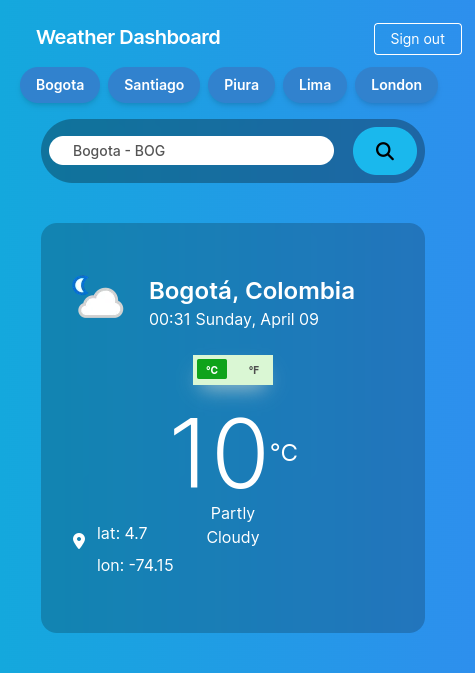

# Weather App



## Requisitos:
- rails 6
- node.js 12+

## Install en desarrollo:
- instalar gemas
```
bundle install
```
- Definir credenciales de la api
```
EDITOR=vim rails credentials:edit --environment development
EDITOR=vim rails credentials:edit --environment test
---------
weather_api:
  key: <weather-api-key>
```
## Ejecutar en desarrollo:
`bin/dev`

## Ejecutar tests:
`rspec`

## Gemas usadas
- auth: devise
- email preview: letter_opener 
- api client: Faraday
- testing:
  - rspec
  - factory_bot_rails
  - shoulda-matchers
  - database_cleaner
  - vcr y webmock
  - capybara
- views:
  - slim-rails
  - tailwindcss-rails
  - font-awesome-sass
