## Inicio
- Hola, mi nombre es adrian peralta

## Demo Funcional
- Vamos a revisar cada una  de las funcionalidades solicitadas
### 1. Crear una cuenta de usuario.
#### 1.1 App
- el usuario puede registrarse usando correo y contraseña
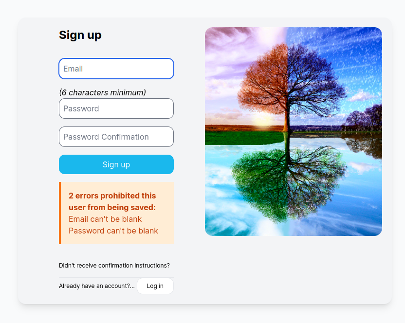
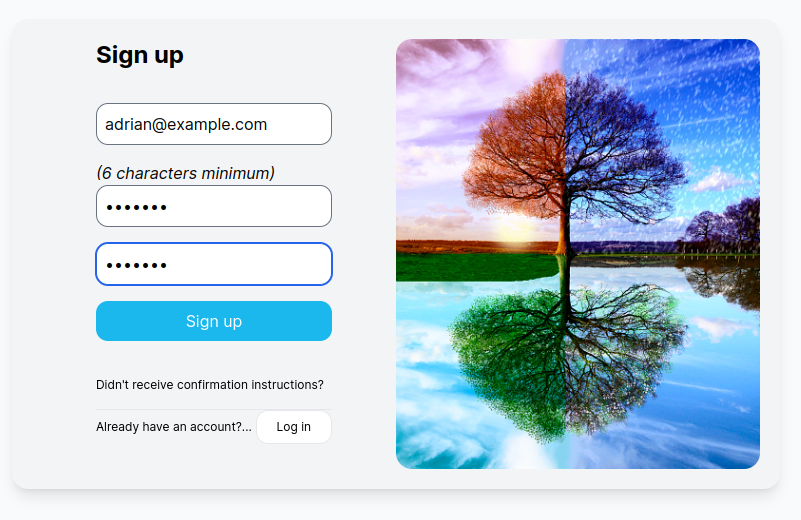

- al registrarse se enviará un correo de confirmación
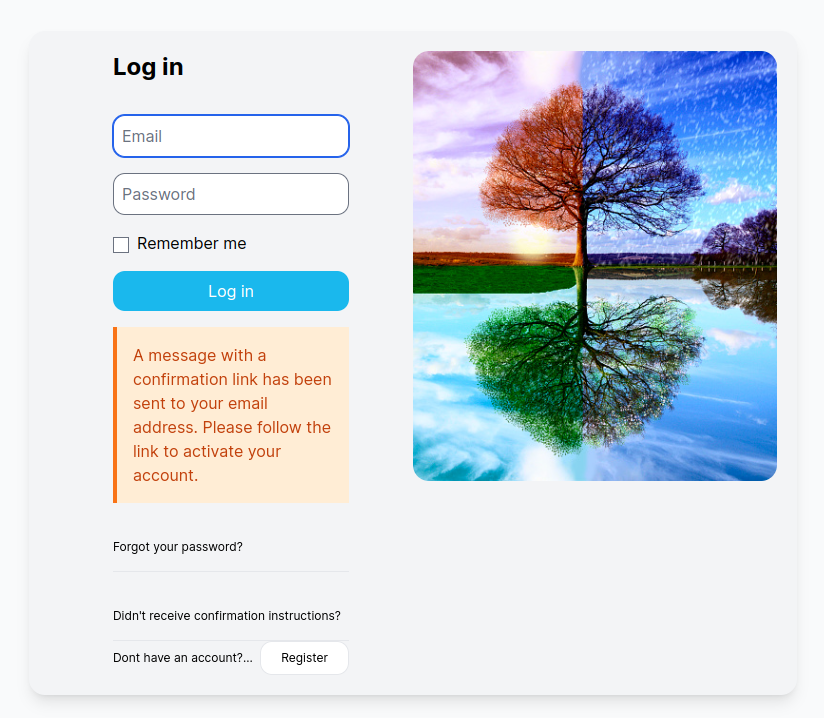
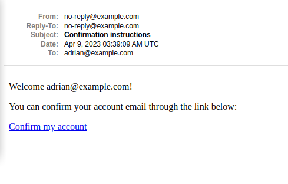
- al hacer click en "Confirm my account", redirigirá a la app para poder ingresar
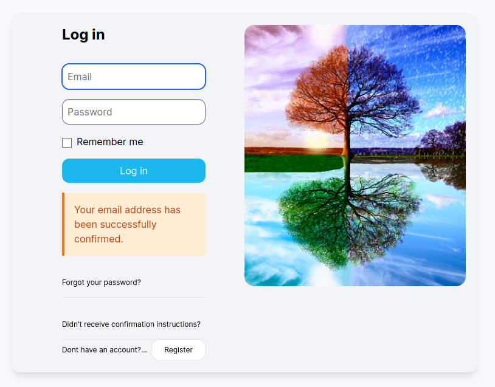

#### 1.2 Código
- el registro se ha realizado con la gema devise, las gemas en el [Gemfile](https://github.com/adnrbp/weather-app/blob/main/Gemfile) están agrupadas según su función dentro de la app Back-End, Storage, Front-End, etc.
- el registro tiene [test definidos](https://github.com/adnrbp/weather-app/blob/main/spec/features/auth/sign_up_spec.rb) usando capybara para simular el uso del app automaticamente
- las [vistas están diseñadas](https://github.com/adnrbp/weather-app/blob/main/app/views/devise/registrations/new.html.slim) usando slim y tailwind teniendo como base las vistas que provee devise.
- las clases css están declaradas en el archivo [application.tailwind.css](https://github.com/adnrbp/weather-app/blob/main/app/assets/stylesheets/application.tailwind.css), donde existe un bloque con clases que inician con "auth-".
- el color primario usado en los botones de login y sign up están definidos por un custom property (variable css) y [integrado en los colores](https://github.com/adnrbp/weather-app/blob/main/config/tailwind.config.js) de tailwind para permitir la creación de un design system y paleta de colores

### 2. Poder loguearse con la cuenta creada.
#### 2.1 App
- el usuario puede ingresar usando su correo y contraseña en su cuenta confirmada
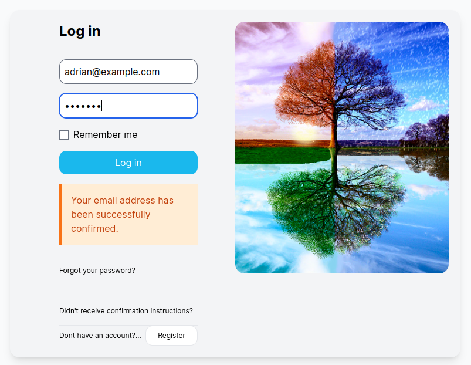
- se indicará el ingreso exitoso
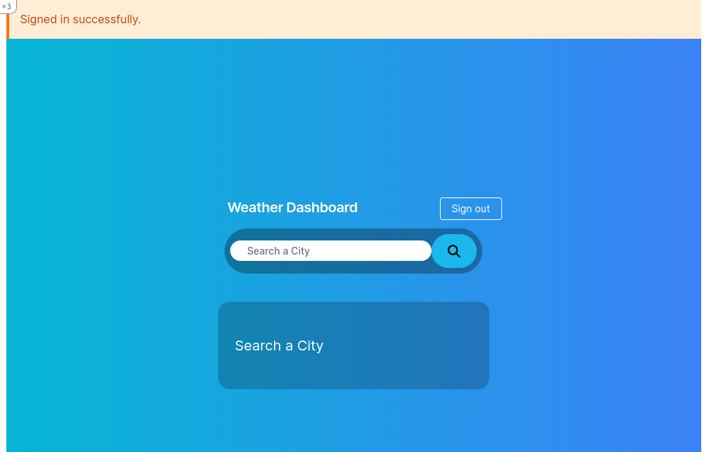

#### 2.2 Código
- el login tiene [test definidos](https://github.com/adnrbp/weather-app/blob/main/spec/features/auth/sign_in_spec.rb) usando un [Factory trait](https://github.com/adnrbp/weather-app/blob/main/spec/factories/users.rb#L7) para obtener un [usuario registrado](https://github.com/adnrbp/weather-app/blob/main/spec/features/auth/sign_in_spec.rb#L12) y que haya confirmado su correo.
- adicional al factory también [hay un test](https://github.com/adnrbp/weather-app/blob/main/spec/features/auth/sign_in_spec.rb#L17) donde se simula la lectura del token desde el último correo enviado y verificar obtener el mensaje de confirmación verificada.
- el logout también tiene un [test definido](https://github.com/adnrbp/weather-app/blob/main/spec/features/auth/sign_out_spec.rb#L3)
- para restringir el acceso se [redirige al login](https://github.com/adnrbp/weather-app/blob/main/config/routes.rb#L10) a todos los usuarios sin autenticación
- todos los usuarios autenticados [acceden a la app](https://github.com/adnrbp/weather-app/blob/main/config/routes.rb#L5)
- la [vista de login](https://github.com/adnrbp/weather-app/blob/main/app/views/devise/sessions/new.html.slim) reutiliza algunas clases definidas para el registro.

### 3. Poder consultar una ciudad con iata y que esta devuelva la temperatura en Celsius o Fahrenheit, y también la latitud y longitud de la ciudad.
#### 3.1 App
- al empezar a escribir se mostrarán ciudades con iata según el texto ingresado
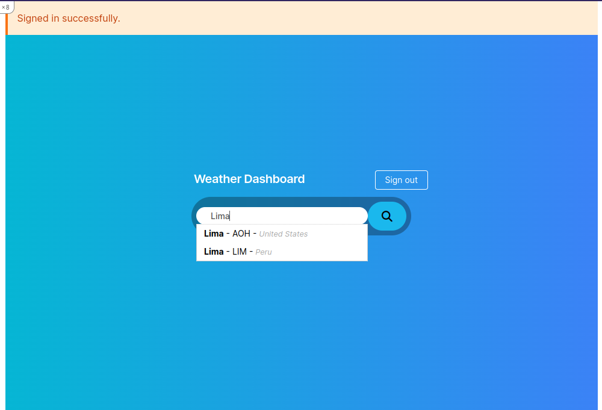

- al seleccionar una alternativa se realizará automaticamente la busqueda
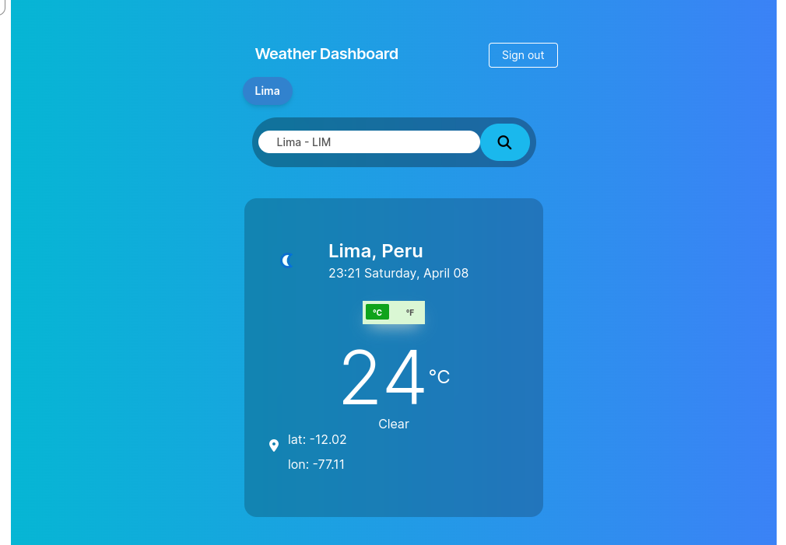

- se mostrará la temperatura en celsius por defecto y un switch (pure css) para cambiar a Fahrenheit la temperatura
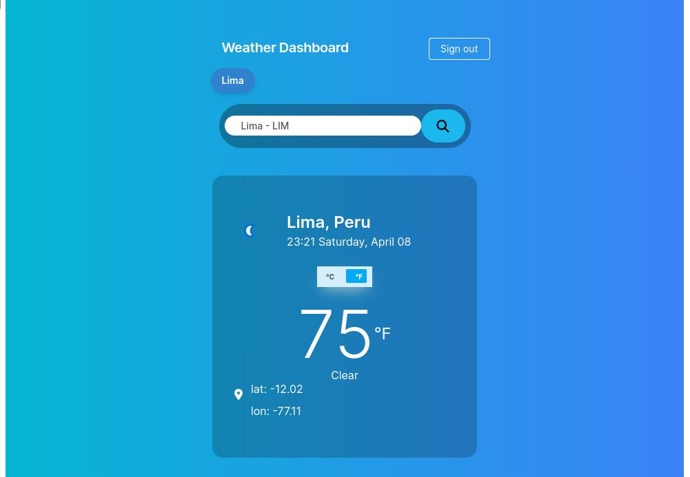
- también se muestra la latitud y longitud de la ciudad con un link a google maps
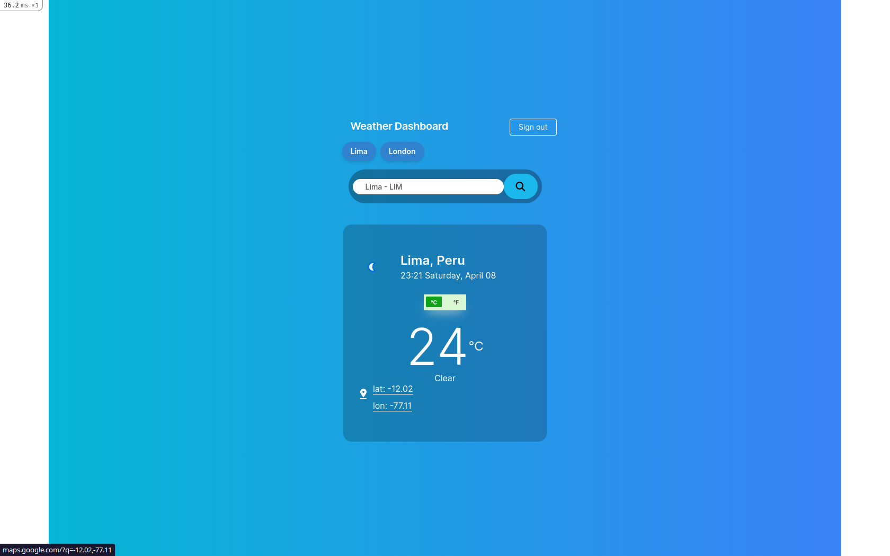

#### 3.2 Código
- las busquedas [también tienen tests](https://github.com/adnrbp/weather-app/blob/main/spec/features/home/search_weather_spec.rb) usando capybara para verificar que el usuario puede buscar y obtener la información definida en los requerimientos: la temperatura y el geopoint, estos tests usan **vcr y webmock** para interceptar y guardar peticiones reales a WeatherAPI y acelerar los tests.
- para poder hacer peticiones al API se ha definido el API Key en [credentials](https://github.com/adnrbp/weather-app/tree/main/config/credentials) de manera encriptada para los ambientes de desarrollo y pruebas.
- esta funcionalidad al ser la principal tiene tests sobre el [cliente del API](https://github.com/adnrbp/weather-app/blob/main/spec/lib/weather_api_spec.rb) y el [caso de uso de busqueda](https://github.com/adnrbp/weather-app/blob/main/spec/services/search_weather_service_spec.rb) encargados de obtener la información del API y de manejar los resultados a mostrar al usuario respectivamente. Ambos usan vcr y webmock.
- Para que solamente se puedan **buscar ciudades con iata**, se agregaron filtros dentro del [servicio de busqueda](https://github.com/adnrbp/weather-app/blob/main/app/services/search_weather.rb#L34), pero adicional a eso se agregó una [funcionalidad de sugerencia](https://github.com/adnrbp/weather-app/blob/main/app/javascript/packs/cities.js) que busca todas las ciudades que tengan iata que hagan match con la busqueda del usuario. 
- la funcionalidad de sugerencia está soportada por un [API que busca las ciudades](https://github.com/adnrbp/weather-app/blob/main/app/controllers/cities_controller.rb) en base de datos según el texto ingresado y [devuelve un json](https://github.com/adnrbp/weather-app/blob/main/app/views/cities/search.json.jbuilder) para mostrar las sugerencias.
- la base de datos de ciudades tiene cerca de 10k ciudades con código iata [importadas usando un script](https://github.com/adnrbp/weather-app/blob/main/lib/tasks/import_csv.rake) desde [archivos csv](https://github.com/adnrbp/weather-app/blob/main/lib/tasks/iata_full_p1.csv)
- las vista están [separada en componentes](https://github.com/adnrbp/weather-app/blob/main/app/views/home/index.html.slim): [formulario](https://github.com/adnrbp/weather-app/blob/main/app/views/home/_search_form.html.slim), [resultado](https://github.com/adnrbp/weather-app/blob/main/app/views/home/_search_result.html.slim) y [últimas busquedas](https://github.com/adnrbp/weather-app/blob/main/app/views/home/_search_latests.html.slim)
- El flujo de busqueda es el siguiente:
  1. **_cities.js_**: script sugerencias usando [easy-autocomplete](https://github.com/adnrbp/weather-app/blob/main/app/javascript/packs/cities.js)
  2. **_search_iata_cities.rb_**: [el servicio](https://github.com/adnrbp/weather-app/blob/main/app/services/search_iata_cities.rb) del [API de sugerencias](https://github.com/adnrbp/weather-app/blob/main/app/controllers/cities_controller.rb) devuelve resultados en [formato json](https://github.com/adnrbp/weather-app/blob/main/app/views/cities/search.json.jbuilder)
  3. **_search_weather.rb_**: [el servicio](https://github.com/adnrbp/weather-app/blob/main/app/services/search_weather.rb) de busqueda
  4. **_lib/weather_api/client.rb_**: [lib cliente](https://github.com/adnrbp/weather-app/blob/main/lib/weather_api/client.rb) de weatherapi.com

### 4. Esta aplicación deberá guardar esta información en algún tipo de caché por si algún usuario vuelve a consultarlo y porque la api tiene llamadas ilimitadas.
#### 4.1 App
- hacemos una 2da busqueda sobre otra ciudad para probar el caché sobre la 1ra busqueda. Se Resalta la fecha y hora.
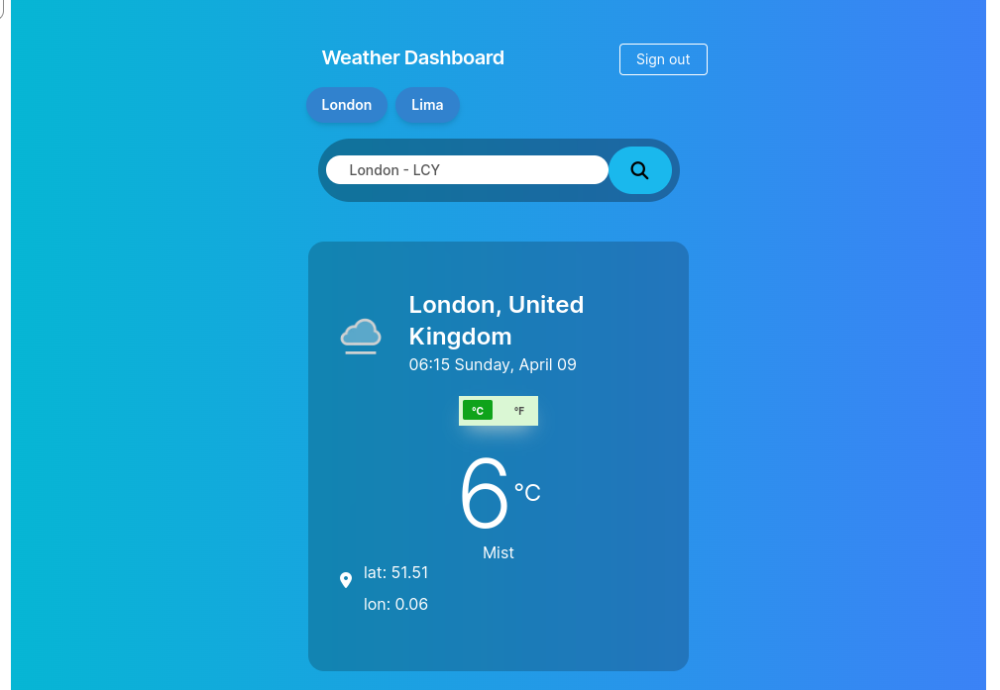
- la 1ra busqueda guardará la petición en caché, la 2da se leerá del caché. Puede verse en la hora local, queda congelada a la hora que se capturó en caché
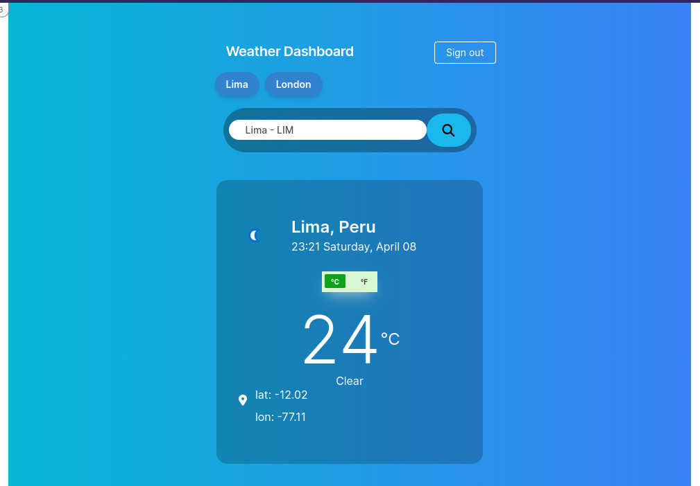

#### 4.2 Código

- para validar el funcionamiento del cache se definió un[Test de cache](https://github.com/adnrbp/weather-app/blob/main/spec/services/search_weather_service_spec.rb#L69) que valida el registro del nombre de la ciudad como key y namespace "weather" y su inexistencia previa.
- el caché se define dentro del [servicio de busqueda](https://github.com/adnrbp/weather-app/blob/main/app/services/search_weather.rb#L45) al funcionar como wrapper del WeatherAPI client

### 5. Esta aplicación tiene que guardar las últimas ciudades pedidas por el usuario
#### 5.1 App
- Las últimas ciudades se van listando de izquierda a derecha, desde las más actuales a las más antiguas respectivamente.
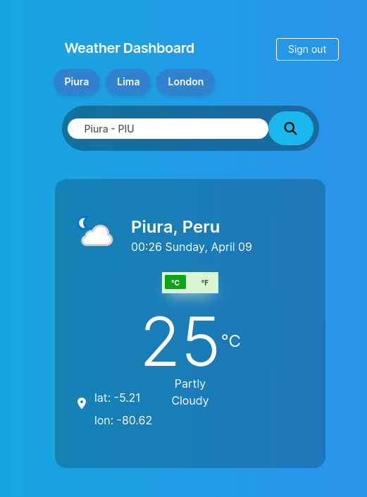

- se puede visualizar las últimas 5 ciudades
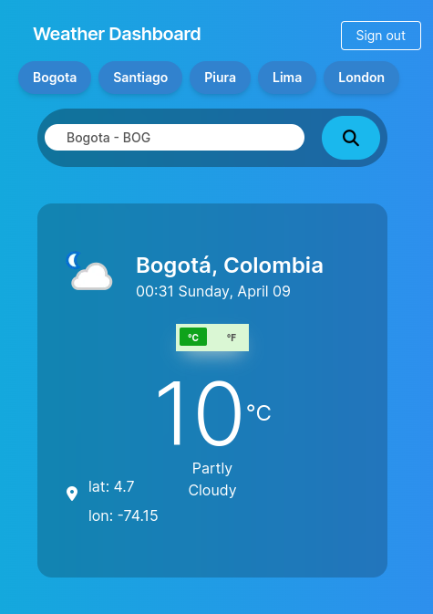

- al hace click en alguna de las ciudades, se realizará una busqueda automatica
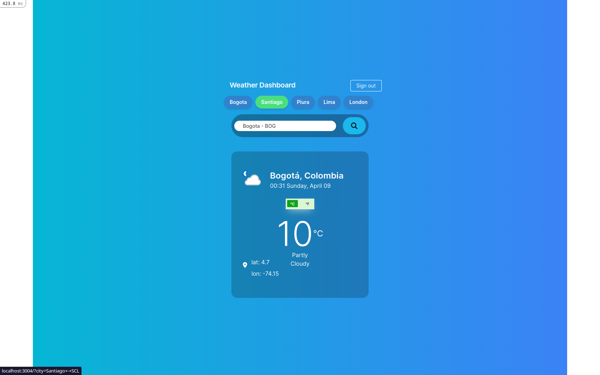
- seleccionar 1 ciudad hará que la lista se vuelva a ordenar mostrando 1ro (izq) la ciudad más recientemente buscada
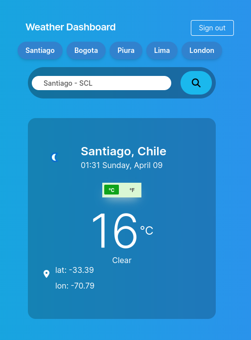

#### 5.2 Código
- Se [definió un servicio](https://github.com/adnrbp/weather-app/blob/main/app/services/search_history.rb) para guardar las ciudades buscadas y leer las últimas 5 buscadas. Cada busqueda actualiza el campo "update_at" que se utiliza para re-ordenar la lista.
- el [servicio se llama](https://github.com/adnrbp/weather-app/blob/main/app/controllers/home_controller.rb#L6) al ingresar por primera vez al hom y después de cada busqueda para actualizar la lista
- [En la vista](https://github.com/adnrbp/weather-app/blob/main/app/views/home/_search_latests.html.slim) se define link para hacer petición usando el nombre de la ciudad y el iata que se buscó

### 6. Debería testear la creación de usuarios
#### 6.1 Código
- la [Aplicación prueba automaticamente](https://github.com/adnrbp/weather-app/tree/main/spec/features/auth) la creación de usuarios, el ingreso y salida.
#### 6.2 Tests
- se han definido 23 tests
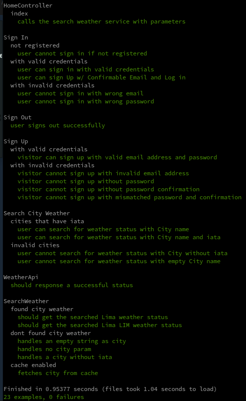

### (Imagenes adicionales)
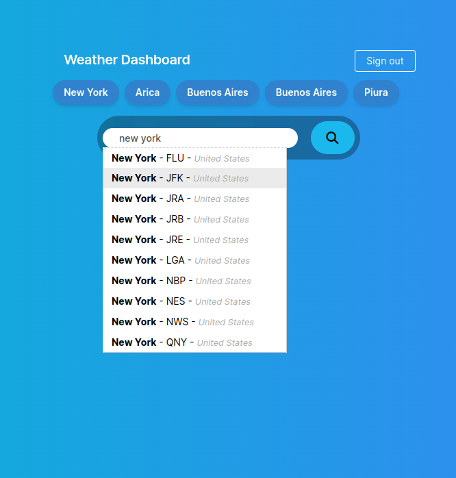
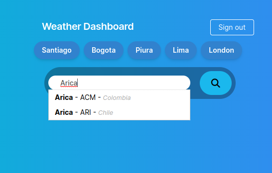

## Algunas cosas adicionales a implementar en el futuro
- Definir Factories para la ciudad y testear los servicios de [sugerencia](https://github.com/adnrbp/weather-app/blob/main/app/services/search_iata_cities.rb) y [historial](https://github.com/adnrbp/weather-app/blob/main/app/services/search_history.rb)
- definir design system y [paleta de colores](https://github.com/adnrbp/weather-app/blob/main/config/tailwind.config.js#L10) según la marca, para unificar y estandarizar la comunicación del producto a lo largo del uso de la app.
- funcionalidades interesantes: [el color gradiente de background](https://github.com/adnrbp/weather-app/blob/main/app/assets/stylesheets/application.tailwind.css#L151) cambie según el grado de temperatura, podría usarse custom properties de css también llamados variables de css.
- github actions para ejecutar los tests y mostrar reportes.